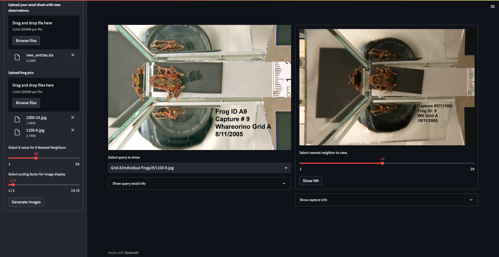

# Pepeketua ID GUI

    This repository contains scripts and resources to develop a GUI that helps biologist identify individual Archey's
frogs (Leiopelma archeyi).

Lior Uzan carried out this work, with the support of Bar Vinograd and Victor Anton.

<!-- PROJECT SHIELDS -->

<!--
*** I'm using markdown "reference style" links for readability.
*** Reference links are enclosed in brackets [ ] instead of parentheses ( ).
*** See the bottom of this document for the declaration of the reference variables
*** for contributors-url, forks-url, etc. This is an optional, concise syntax you may use.
*** https://www.markdownguide.org/basic-syntax/#reference-style-links
-->

[Contributors][contributors-url]
[Issues][issues-url]
[MIT License][license-url]



## Overview

    This project runs some scripts to process previously identified frog photos, then run a GUI that helps biologists identify individual frogs. The interface uses deep learning tools behind the scenes to extract ID vectors from new frogs and compares them to previously identified and extracted ID vectors using a nearest neighbor search.

## Requirements

* Docker

## To start the app

1. Clone https://github.com/wildlifeai/pepeketua_interface.git to local device from CMD line:

   `git clone https://github.com/wildlifeai/pepeketua_interface.git`
2. Download zipped_files folder and save to:
   `C:\path\to\dir\pepeketua_interface`
3. On the command line, change to repo directory:
   `cd C:\path\to\dir\pepeketua_interface`
4. Execute the command (This step should take about an hour to complete.)

   `docker compose run pepeketua-interface python process_previous_captures.py`
5. After the previous step is completed, execute the command

   `docker compose up -d`
6. Open [http://localhost][pepeketua_interface_url] to access and use the app!

## To close the app

    Open a command line terminal to`../pepeketua_files` and run the command:

```shell
docker compose down
```

## Usage

1. There are demo images and excel spreadsheet within "pepeketua_interface/example_files" for first time users to visualize the functionality off the app
2. After the dockers from the previous section finish processing the old capture data, the app will be available at [this url][pepeketua_interface_url]. See [this presentation](http://bit.ly/3SmUsj0) to learn about the app and how to use it.
3. After you update your capture excel sheets, run the code below to update the internal database.

```bash
docker compose run pepeketua-interface python process_previous_captures.py
```

## How it works

- The scripts clean all frog sightings in the excel sheets, saves them to a SQL server and save corresponding pictures
  to a LMDB.
- Then it extracts the id vectors from the frog images and saves those to Faiss indices, one per grid (to compare frogs only within their grids).
- Then the Streamlit server is started (GUI) and is accessible at [this url][pepeketua_interface_url]

## Extra files saved to the shared folder:

- `pepeketua_files/parse_previous_captures.log` Log for script which processes and saves previous captures to internal db.
- `pepeketua_files/extract_identity_vectors.log` Log for script which extracts the id vectors from previous capture photos.
- `pepeketua_files/incorrect_filepaths.csv` All rows where there is a mismatch between the photo path and the the "Frog ID #" column.
- `pepeketua_files/missing_photos.csv` All rows that have no "filepath" column value.

## Rebuilding base docker images

This project uses two base images specified by the following Dockerfiles. If you need to rebuild them here's how:

- `base_image.Dockerfile` - This docker holds the Ubuntu packages needed to run the code. To rebuild and push it to my docker repository, download it and run the command
  ```shell
  docker build --no-cache -t ghostcow/pepeketua:base_image -f base_image.Dockerfile . && docker push ghostcow/pepeketua:base_image
  ```
- `python_env.Dockerfile` - This docker is built from `ghostcow/pepeketua:base_image` and clones the repository to it's memory, then installs all python packages specified by `requirements.txt`. It provides the python environment used by the code. To rebuild and push it to my docker repository, download the file and run the command
  ```shell
  docker build --no-cache -t ghostcow/pepeketua:python_env -f python_env.Dockerfile . && docker push ghostcow/pepeketua:python_env
  ```

## Enabling app to accept captures after 2020

Right now the app supports only captures from before the year 2020, and filters out the rest. To allow the app to accept captures after 2020-

1. Close the app by following [these instructions](#to-close-the-app).
2. Create a pull request to remove [the date filter here](https://github.com/wildlifeai/pepeketua_interface/blob/main/previous_capture_processing/clean_save_old_capture_data.py#L443). Remove or edit it to fit your needs, commit, and wait until it's merged.
3. Rebuild the docker made from ``python_env.Dockerfile``, [see instructions here](#rebuilding-base-docker-images).
4. Rerun the capture processing script by following step 7 from [this section](#to-start-the-app).
5. Restart your app by following step 8 from [this section](#to-start-the-app).

E-mail me with any questions.

## Citation

If you use this code or its models, please cite:

Uzan L, Vinograd B, Anton V (2023). Pepeketua ID - A frog identification
app. https://github.com/wildlifeai/pepeketua_interface

## Collaborations/questions

We are working to make our work available to anyone interested. Please feel free to [contact us][contact_info] if you
have any questions.

<!-- MARKDOWN LINKS & IMAGES -->

<!-- https://www.markdownguide.org/basic-syntax/#reference-style-links -->

```shell
docker compose run pepeketua-interface python process_previous_captures.py
```

```shell
docker compose run pepeketua-interface python process_previous_captures.py
```

[contributors-shield]: https://img.shields.io/github/contributors/wildlifeai/pepeketua_interface.svg?style=for-the-badge
[contributors-url]: https://github.com/wildlifeai/pepeketua_interface/graphs/contributors
[forks-shield]: https://img.shields.io/github/forks/wildlifeai/pepeketua_interface.svg?style=for-the-badge
[forks-url]: https://github.com/wildlifeai/pepeketua_interface/network/members
[stars-shield]: https://img.shields.io/github/stars/wildlifeai/pepeketua_interface.svg?style=for-the-badge
[stars-url]: https://github.com/wildlifeai/pepeketua_interface/stargazers
[issues-shield]: https://img.shields.io/github/issues/wildlifeai/pepeketua_interface.svg?style=for-the-badge
[issues-url]: https://github.com/wildlifeai/pepeketua_interface/issues
[license-shield]: https://img.shields.io/github/license/wildlifeai/pepeketua_interface.svg?style=for-the-badge
[license-url]: https://github.com/wildlifeai/pepeketua_interface/blob/main/LICENSE
[contact_info]: contact@wildlife.ai
[pepeketua_interface_url]: http://localhost
